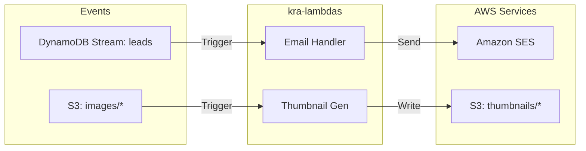

# kra-lambdas

Serverless background workers for the **KRA** portfolio. These functions handle asynchronous tasks such as image processing and automated notifications, triggered by **AWS S3** events and **DynamoDB Streams**.

**Stack:** Node.js **20**, TypeScript, **AWS SDK v3** (SES, S3), **Sharp** for image manipulation, **Esbuild** for bundling, **Vitest** for unit testing.

[](https://sonarcloud.io/summary/new_code?id=krealalejo_kra-lambdas)


---

## Prerequisites

- **Node.js 20+** and **Yarn**
- **AWS CLI** configured for testing or deployment
- **Amazon SES** identity verified (for email notifications)

---

## Quick start

1. Install dependencies: `yarn install`
2. Run tests to verify logic: `yarn test`
3. Build the deployment bundles: `yarn build`
4. Bundles are generated in the `dist/` directory.

---

## Commands

| Action | Command |
|--------|---------|
| Install dependencies | `yarn install` |
| Build bundles (Esbuild) | `yarn build` |
| Type checking | `yarn typecheck` |
| Unit tests (Vitest) | `yarn test` |
| Unit tests (Watch mode) | `yarn test:watch` |

---

## Functions

These functions are deployed as individual Lambdas and triggered by AWS events.

| Handler | Trigger | Description |
|---------|---------|-------------|
| `src/index.handler` | **S3** (Object Created) | **Thumbnail Generator**: Detects uploads to `images/` and generates WebP thumbnails in `thumbnails/`. |
| `src/email-handler.handler` | **DynamoDB Stream** (INSERT) | **Email Notifier**: Processes new items in the `leads` table and sends a notification email via SES. |

---

## Architecture



> Full system architecture (C4 Level 1, 2 & 3): [kra-docs-architecture](https://github.com/krealalejo/kra-docs-architecture)

**Workflow:** The handlers are designed to be idempotent and stateless. The thumbnail generator uses `sharp` for high-performance image processing, while the email handler consumes the `NewImage` from DynamoDB streams to capture lead data.

### Source layout

```
kra-lambdas/
├── esbuild.config.mjs    # Build configuration
├── package.json
├── src/
│   ├── index.ts          # S3 thumbnail handler
│   ├── email-handler.ts  # DynamoDB stream handler
│   ├── thumbnail.ts      # Image processing logic
│   ├── email.ts          # SES notification logic
│   └── *.test.ts         # Vitest unit tests
└── dist/                 # Compiled assets (ignored)
```

---

## Configuration

Environment variables configured in the Lambda environment (managed via Terraform in `kra-infra`):

| Variable | Purpose |
|----------|---------|
| `FROM_EMAIL` | Verified SES email address used as sender and recipient |
| `AWS_REGION` | AWS region for SDK clients |

---

## Deployment

These functions are provisioned and managed via **Terraform** in the `kra-infra` repository. The CI/CD pipeline in GitHub Actions automatically builds and uploads the zip files to the corresponding Lambda functions on every push to `main`.
